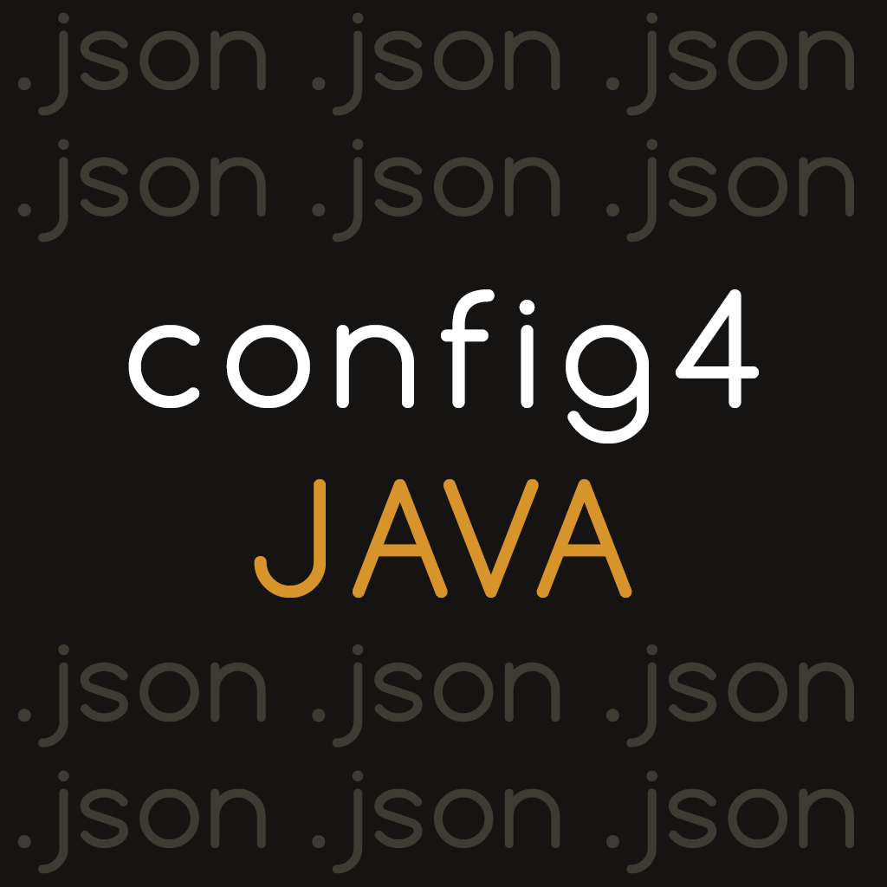

# JSONConfig4Java

Welcome to the JC4J! This library provides you with easy management of your .json configuration files!
With JC4J you can create configs and easily read them avoiding unsafe casts and boilerplate code.

**This README is for the version 3.4b!**

**If you have any questions, or you have found bugs, please contact with me in my discord — `Nedelis#9496`!**

